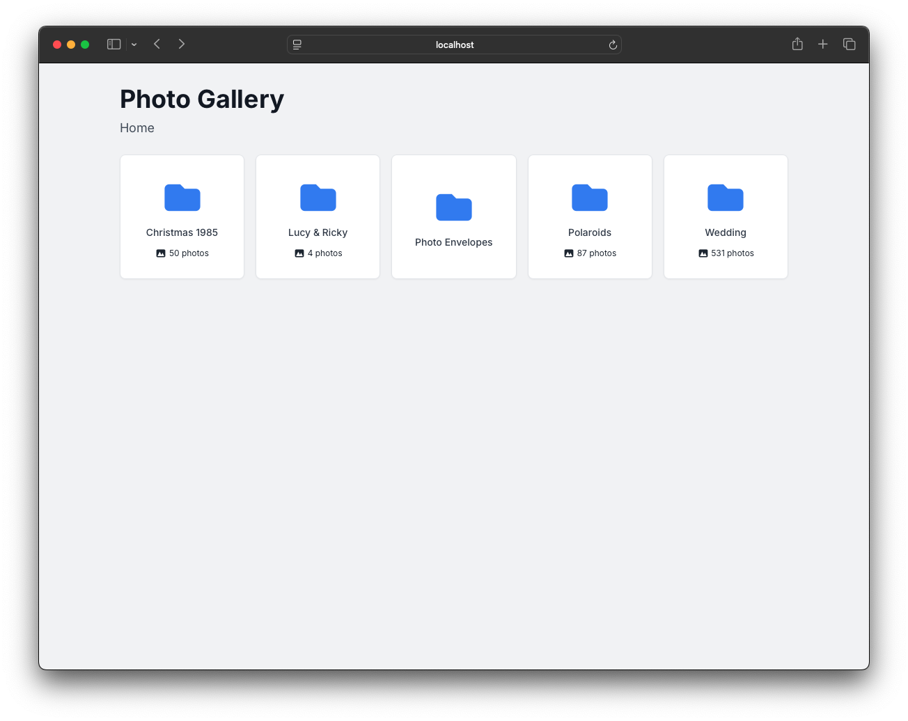
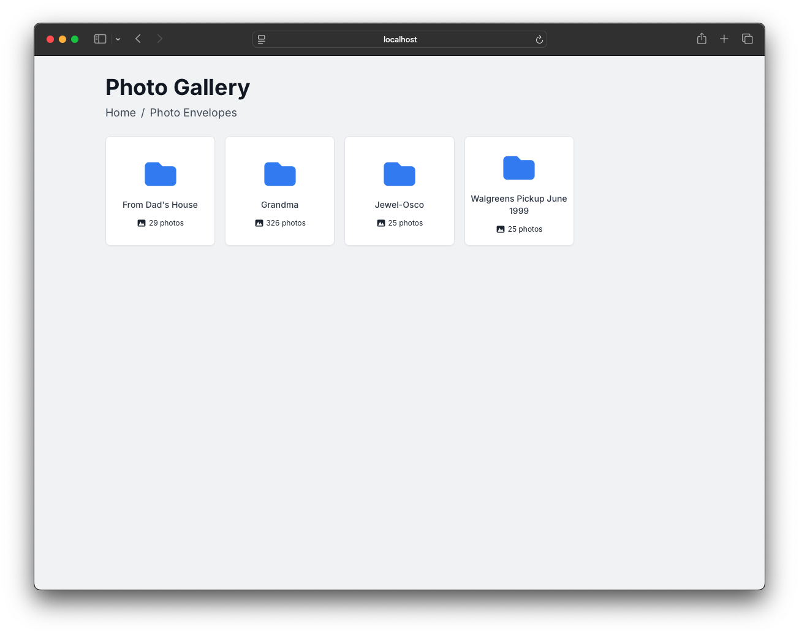
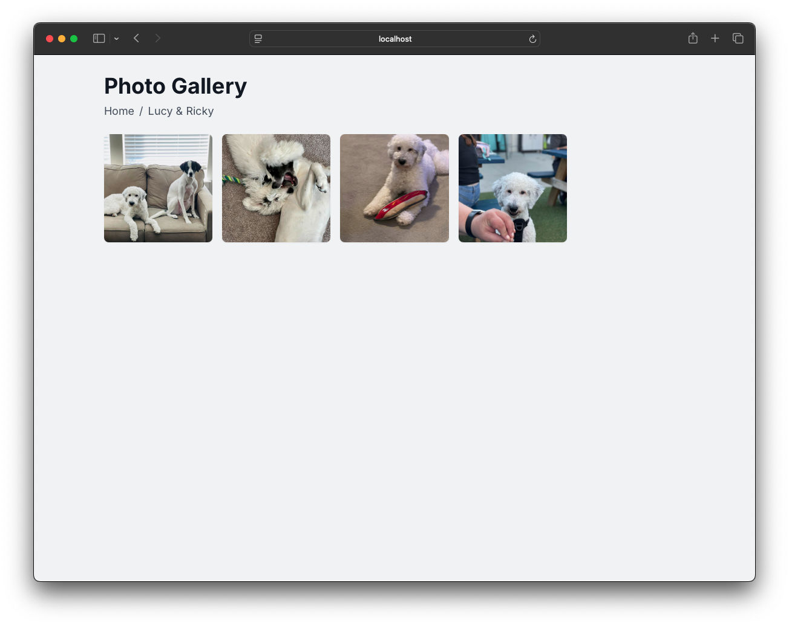
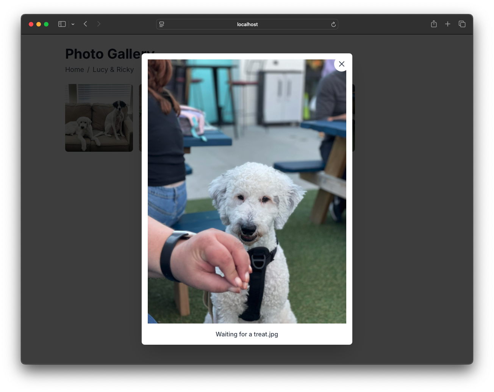

# 📷 Static Photo Gallery Generator

<p align="center">
  
  
  
  
</p>

This is a simple static photo gallery viewer that loads and displays images organized in folders using a JSON index. It’s a single-page application built with plain HTML, Tailwind CSS, and vanilla JavaScript, designed to be hosted on any static file host (like S3 or GitHub Pages).

## 📚 Background

I built this after clearing out my parent’s home and finding thousands of old family photos. After digitizing them, I needed a way to organize and archive them in a way that was simple and permanent. The goal was to host a static gallery on AWS S3 and CloudFront so my family could view everything securely without depending on any external services. I wanted to keep the folder structure, avoid needing a database or backend, and make it easy to browse in any browser. This setup worked well for what I needed, so I’m sharing it in case it helps someone else.

## ⚠️ **Disclaimer**
This project was generated by Google's Gemini AI and shared here by me in the hope that it might help someone else solve a similar problem. I did not write most of the code.

---

## 🛠 How It Works

- The `index.html` file is a single-page application that loads a JSON file (`index.json`) from the current directory.
- A Bash script (`generate-gallery-indexes`) recursively walks through a folder structure and creates `index.json` files for every directory.
- The gallery supports nested folders and renders them as clickable tiles, with photo previews and modal viewing.

---

## 📁 Folder Structure

Your photo directory should look something like this:

```
photos/
|-- index.html # The web app UI (must be in root of the gallery)
├── index.json
├── vacation/
│ ├── beach.jpg
│ ├── sunset.jpg
│ └── index.json
├── events/
│ ├── wedding.jpg
│ ├── birthday/
│ │ ├── cake.jpg
│ │ └── index.json
│ └── index.json
```

---

## 🚀 Getting Started

### 1. Clone or download the repo

```bash
git clone https://github.com/radiantnode/static-photo-gallery.git
cd static-photo-gallery
```

### 2. Setup your gallery

Have your photos in a folder (e.g. `photos/`) and nest folders however you like.

### 3. Copy the `index.html` file to your photos folder.

```bash
cp index.html /path/to/photos
```

### 4. Generate `index.json` files

Run the script to create `index.json` files:

```bash
chmod +x generate-photos-indexes
./generate-gallery-indexes /path/to/photos
```

You should now see `index.json` files inside every folder that contains images or subfolders.

### 4. Open or deploy the gallery

To view locally:

```bash
cd /path/to/photos
python3 -m http.server 8080
```

Then go to http://localhost:8080/ in your browser.

To deploy online:

Upload the entire contents of `/path/to/photos` to a static host like GitHub Pages or AWS S3.

Make sure the folder structure is preserved.

The app will work entirely client-side.

---

## 🔒 Privacy Note

The gallery runs entirely in the browser. Nothing is uploaded or tracked. Just make sure to protect your hosting setup if your images are private.
